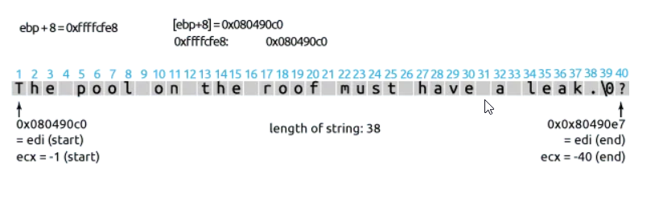

# Practical Reverse Engineering Solutions – Page 11

01. EDI is a pointer to [ebp+8]
02. edx save the pointer of EDI in order to retrieve it whenever edi is changed
03. EAX =0(xor eax,eax => set eax to zero)
04. ecx = -1 (0fffffff =-1)
05. repne scasb ==> will scan bytes of a string until the end of string == Null , also repne scasb will use EDI as a pointer &The instruction decreases the value of ECX after each byte comparison 

### So answering to the first question [ebp+8] is pointer to a string (char*) 

06. ecx=ecx+2
07. ecx= -(ecx)(ecx used to be negative because of SCASB so we got to NEG again to become positive so we can use it for STOSB)
08. AL=[ebp+0Ch] (AL size is byte so logically it couldn't contain a pointer to a string or ahole adress but it contains some bits that make a ascii charcter also bcz of the STOS used after)
09. reset EDI with the orginal pointer stored in EDX
10. rep stosb ==> will copy what's on AL(ascii charcter) in each byte of the string in EDI(will end when ecx=0)
### So answering to the first question [ebp+C] is charcter(char)

11. This copies the address of the string to EAX. EAX holds the return value of the function, so the snippet returns a pointer to the modified string.

## Exemple:(EDI point at 'The pool on the roof must have a leak.')

as we said (repne scasb) decreases the value of ECX after each byte comparison and we started as ECX=-1 --> ECX ends up to be -40
(the '?' is random charcter in the memory it's there after our string cuz we scroll up the hole string to end and randomly '?' has been there) 

ECX=ECX+2 at line 6==> ECX=-40+2=-38 (the length of our string) 
let's assume [EBP+C]='x'
after STOSB is exucted EDI will point at the begin of our new string "xxxxxxxxxxxxxxxxxxxxxxxxxxxxxxxxxxxxxx"

